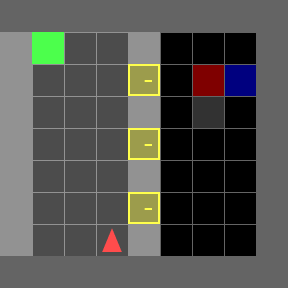

# Reward Machines for Deep RL in Noisy and Uncertain Environments


We provide a framework for Reward Machines (or similar formal task specifications like Linear Temporal Logic) when the propositions cannot be perfectly evaluated. 

This is applicable to settings where propositional evaluations are uncertain due to partially observability, noisy sensors, classification error, and so on. The methods used are described in our accompanying paper (arxiv: https://arxiv.org/abs/2406.00120). See [videos/](videos/) to watch some replays of the agents. 

## Environments
We provide a lightweight [toy environment](toy_experiments/) along with a deep RL framework for larger environments. We include MiniGrid and MuJoCo environments as example problems and our framework is easily extensible to other environments. 

  

## Algorithms
We currently support the following Reward Machine algorithms that operate without the ground-truth labelling function (implementations are found in [src/rm_wrappers.py](src/rm_wrappers.py))

- **Naive**: Use discrete predictions about the most likely propositions at each timestep to update the Reward Machine.
- **Independent Belief Updating**: Use probabilistic predictions about propositions at each timestep to update a *belief* over Reward Machine states.
- **Temporal Dependency Modelling**: Consider the entire history of observations to predict a *belief* over Reward Machine states.
- **Recurrent PPO**: Consider the entire history of observations to predict the best action.

The choice of algorithm depends on what type of abstraction model you have available. For example, if you have a probabilistic classifier of propositional evaluations given the current observation, you can use *Naive* or *Independent Belief Updating*. 

Our paper finds that *Temporal Dependency Modelling* is the most performant, as *Naive* and *Independent Belief Updating* can have serious pitfalls due to accumulating errors. Nonetheless, they can still perform much better than Recurrent PPO, which does not use the Reward Machine specification at all. See [/videos](/videos) for examples.

Types of abstraction models are defined in [src/detector_model.py](src/detector_model.py) and can be trained using labelled data from the environment. Our RL training code allows you to train abstraction models directly from the agent's interaction data, or you can pretrain these using an offline dataset (see [scripts/collect_offline_data.py](scripts/collect_offline_data.py) and [scripts/pretrain_detector.py](scripts/pretrain_detector.py)).

## Quick Start
1. `pip install -r requirements.txt`
2. (Optional: MuJoCo environments)
   - To run [MuJoCo](https://mujoco.org/) environments, you'll need to install it (we used version 2.1).
   - Install [OpenAI Safety Gym](https://github.com/openai/safety-gym), which is build on MuJoCo. We assume it is installed at `../safety-gym`.

Run `. setup.sh` each time to update the `PYTHONPATH`. We provide [scripts](scripts/) that allow you to manually play around with the MuJoCo and MiniGrid environments, train agents using RL, and visualize trained agents. We also provide scripts to generate labelled data in an environment, and to train abstraction models from that data.

We gratefully acknowledge the following open-source dependencies that our code builds upon:
- [Reward Machines](https://github.com/RodrigoToroIcarte/reward_machines)
- [OpenAI Safety Gym](https://github.com/openai/safety-gym)
- [torch-ac](https://github.com/lcswillems/torch-ac)
- [MiniGrid](https://github.com/Farama-Foundation/Minigrid)

## Citation

To cite this paper or code please use:

```
@article{li2024reward,
  title={Reward Machines for Deep RL in Noisy and Uncertain Environments},
  author={Li, Andrew C and Chen, Zizhao and Klassen, Toryn Q and Vaezipoor, Pashootan and Toro Icarte, Rodrigo and McIlraith, Sheila A},
  journal={arXiv preprint arXiv:2406.00120},
  year={2024}
}
```
