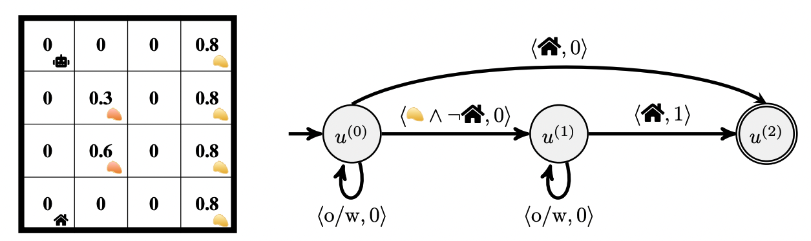

# Gold Mining Problem

This is a simple tabular domain to test RM algorithms with noisily evaluated propositions. The agent's goal is to collect gold by digging at one of the square's containing gold (the right-most column) then deliver it to the depot. Two squares in the second column contain fool's gold and have no value. However, the agent has uncertainty over which locations yield gold and should learn a policy that is robust to this uncertainty. One strategy is to dig at several different spots before visiting the depot. The environment (with the agent's probabilistic belief of where gold can be found) along with a Reward Machine encoding this task are shown below.

`gold_mining_env.py` implements the domain with the agent's probabilistic belief of gold. `gold_mining_algos.py` implements several strategies for exploiting RM structure under an uncertain labelling function (in this case, whether gold was actually obtained). We implement two modes of training:
1. **The agent observes ground-truth rewards during training.** This assumes access to the ground-truth labelling function while training, but we can deploy the trained policy without this privileged information.
2. **Without access to rewards.** Instead, the agent uses its belief over transitions in the RM to generate its own *perceived* rewards.
