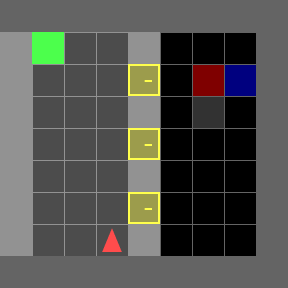

# Findings

The Temporal Dependency Modelling algorithm is robust in all domains when the abstraction model is trained from data. Naive and Independent Belief Updating can be useful when you only have a noisy predictor of propositions, but they make assumptions that can fail.

In the Traffic Light domain, Naive intentionally drives *backwards* through the intersection to avoid observing the light colour, often resulting in a red light violation (**left**). On the other hand, Temporal Dependency Modelling
is aware of its uncertainty when driving backwards---instead, it observes the light and patiently waits for a green light before crossing the intersection (**right**).

  

In Kitchen, Independent Belief Updating incorrectly aggregates probabilities in Kitchen (**left**). It believes that by doing nothing, all the chores are increasingly likely to be complete over time! Temporal Dependency Modelling
correctly models probabilities over time and enters the kitchen to ensure all chores are done (**right**).

 
